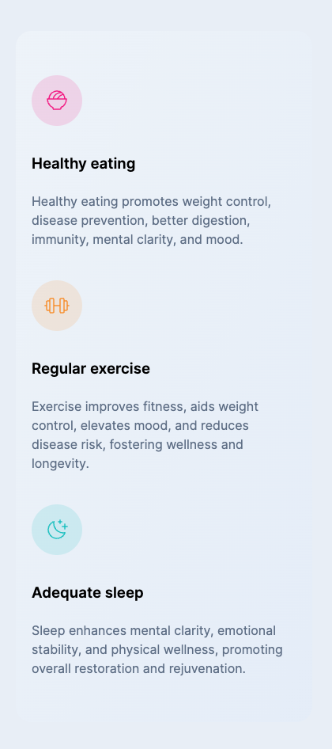
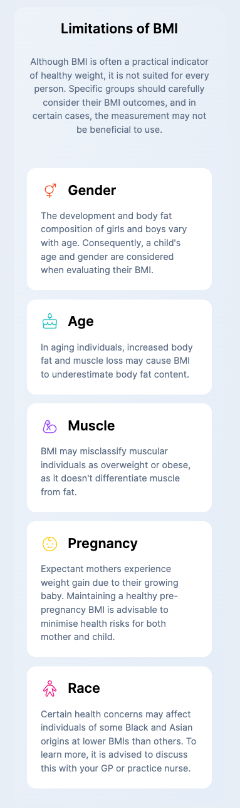
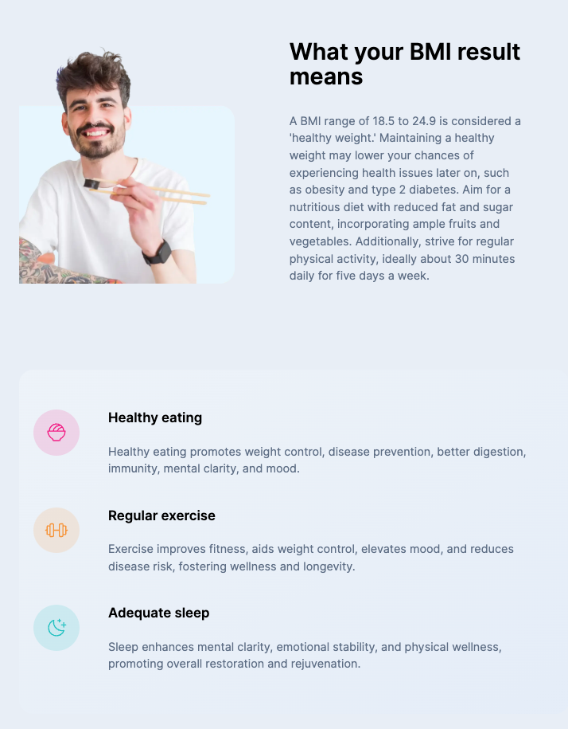

# Frontend Mentor - Body Mass Index Calculator solution

This is a solution to the [Body Mass Index Calculator challenge on Frontend Mentor](https://www.frontendmentor.io/challenges/body-mass-index-calculator-brrBkfSz1T). Frontend Mentor challenges help you improve your coding skills by building realistic projects. 

## Table of contents

- [Overview](#overview)
  - [Screenshot](#screenshot)
- [My process](#my-process)
  - [Built with](#built-with)
  - [What I learned](#what-i-learned)

## Overview

### Solution Screenshots

#### Mobile View
| Hero                                        | Your Results                                | Tips                                        | BMI Limits                                  |
| ------------------------------------------- | ------------------------------------------- | ------------------------------------------  | ------------------------------------------- |
|  |  |  |  |

#### Tablet View
| Veiw One                                    | View Two                                    | View Three                                  |
| ------------------------------------------- | ------------------------------------------- | ------------------------------------------- |
|  |  |  |

## My process

### Built with

- Mobile-first workflow
- Semantic HTML5 markup
- Flexbox